&nbsp;
# 1.  Airtable

[Describir qué es]

**Importante**: Regístrate en https://airtable.com/invite/r/zbo8aKUM
para que me regalen $10 USD de crédito por la invitación 😄

## 1.1 Crear la base de datos

Simplemente ingresa a la página principal https://airtable.com
y presiona el botón _+ Crear_.

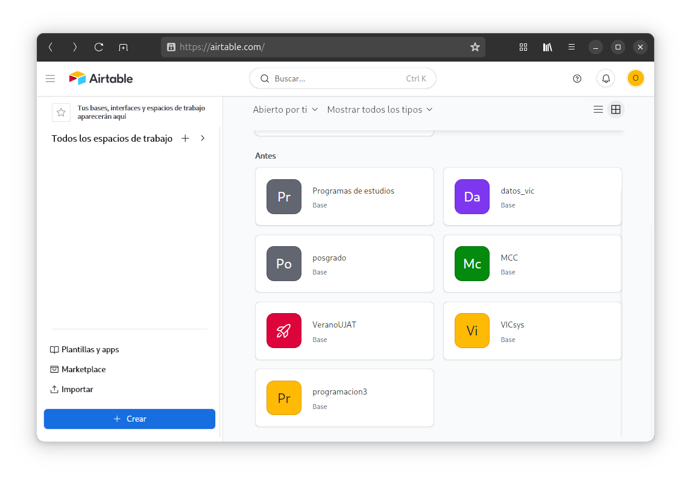

Ahora selecciona la opción **Empezar desde cero**.

<mark>Nota:</mark> La UI de Airtable cambia a cada rato,
así que las siguientes pantallas pueden no ser las mismas.

La siguiente figura muestra la vista inicial de nuestra base de datos.
Nota que aparece un asistente en la parte derecha. No lo necesitaremos así que puedes cerrarlo.

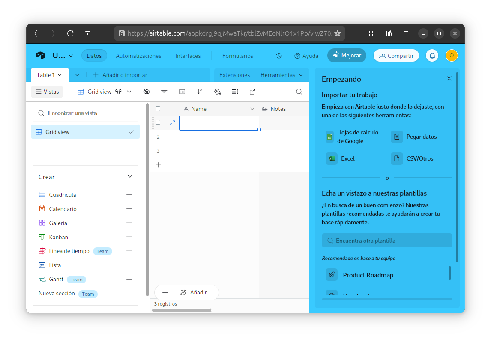
 
Ahora vamos a crear los campos necesarios para guardar la información. Como ya 
existen varios campos creados automáticamente por Airtable, simplemente debes hacer
clic derecho sobre cada uno de los campos y seleccionar la opción **Editar campo**.

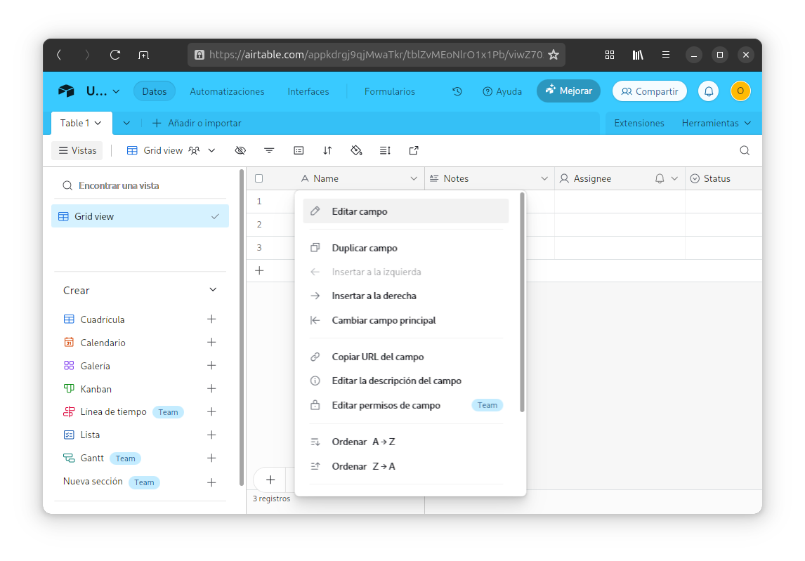

Para el caso de nuestro primer campo, le colocaremos por nombre `num_empleado` y como
tipo le asignaremos `Texto de una sola línea`.

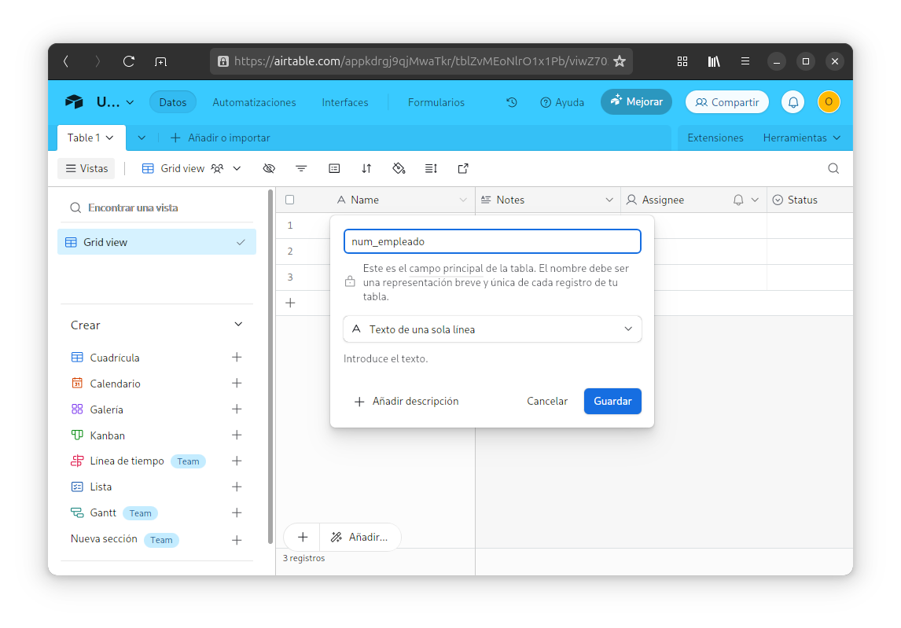

El siguiente campo será `grado` con tipo `Selección única`. Después agregar las opciones 
`Licenciatura`, `Maestría` y `Doctorado`.

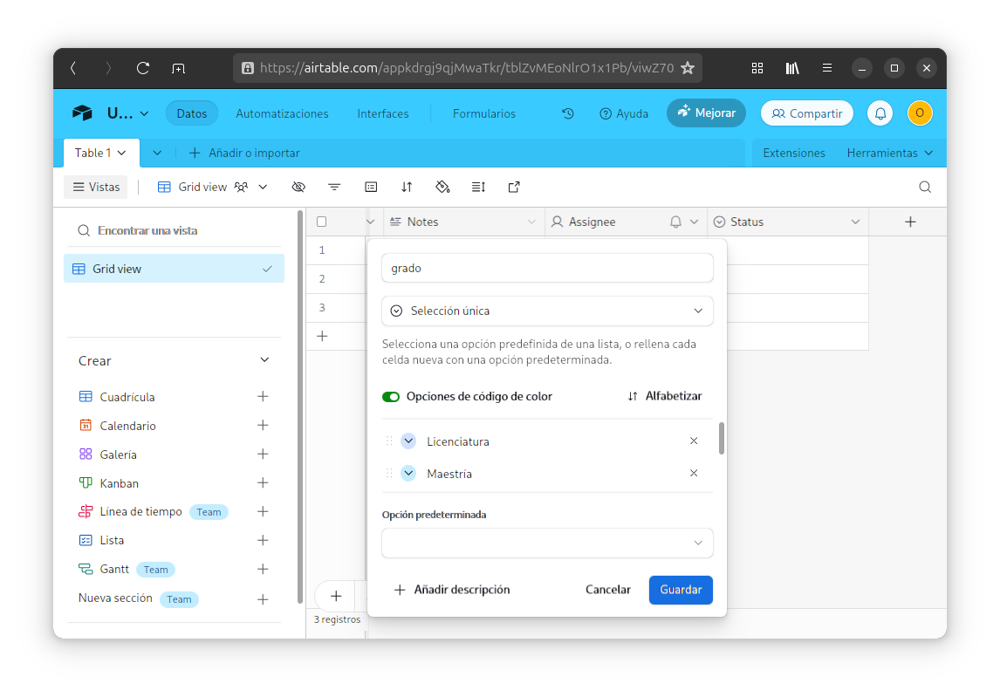

Continuamos con el campo `nombre` de tipo `Texto de una sola línea`.

Para el campo `apellidos` hacemos lo mismo

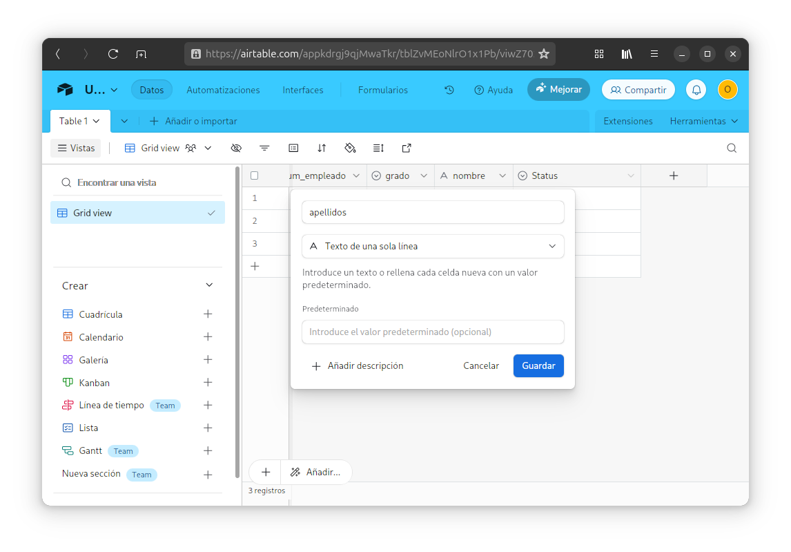

Como ya se acabaron los campos predeterminados de Airtable, presionamos el botón **+** para agregar
un nuevo campo.

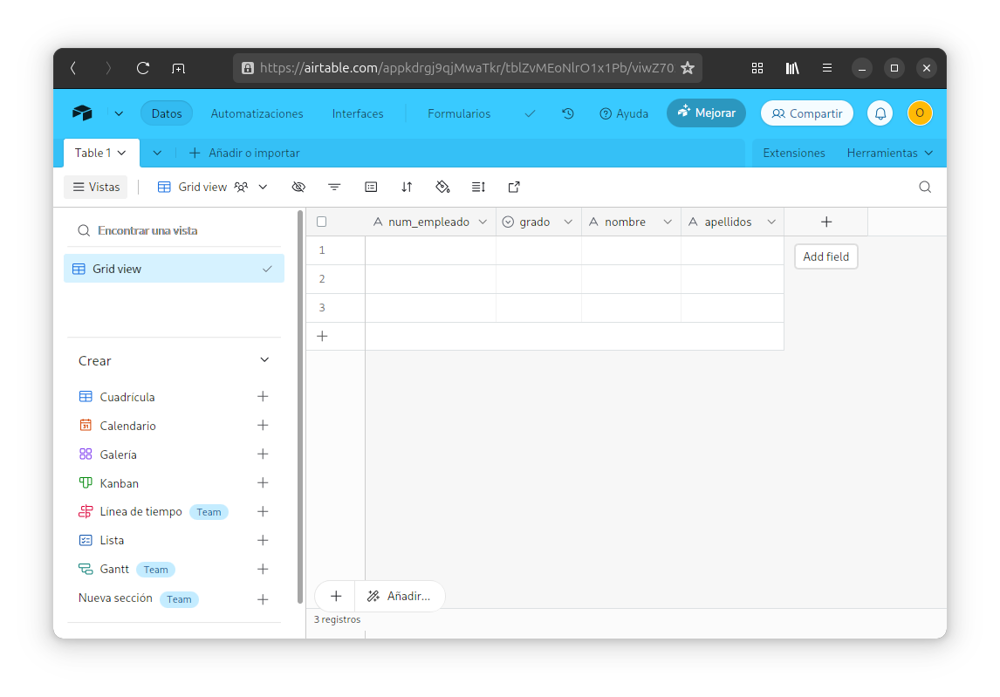

Añadimos el campo `es_prodep` y le asignamos el tipo `Casilla de verificación`.

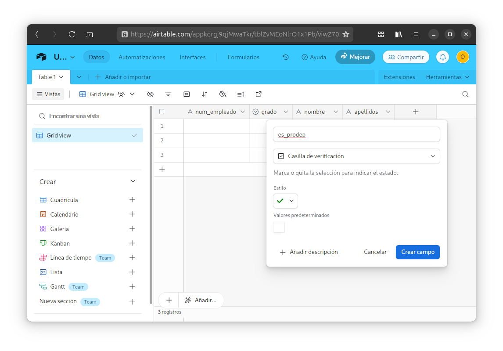

Finalmente, el campo `division` será `Texto de una sola línea`.

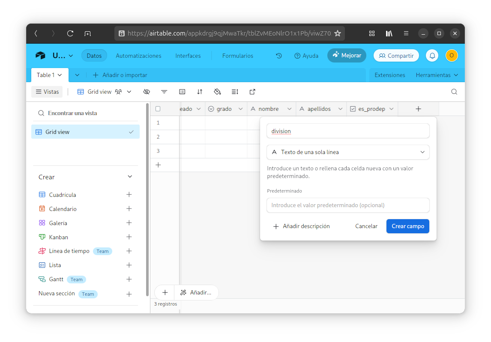

Ahora vamos a cerrar el panel **Vistas** que se se muestra en la parte derecha de la página.

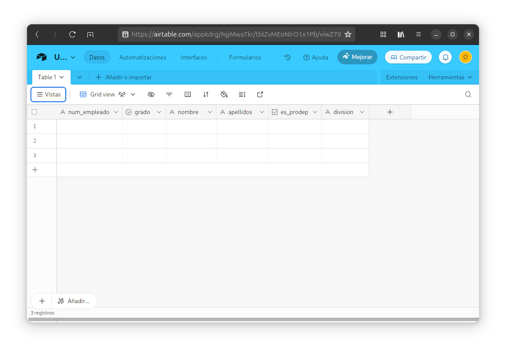

Y vamos a eliminar los registros vacíos que por defecto crea Airtable.

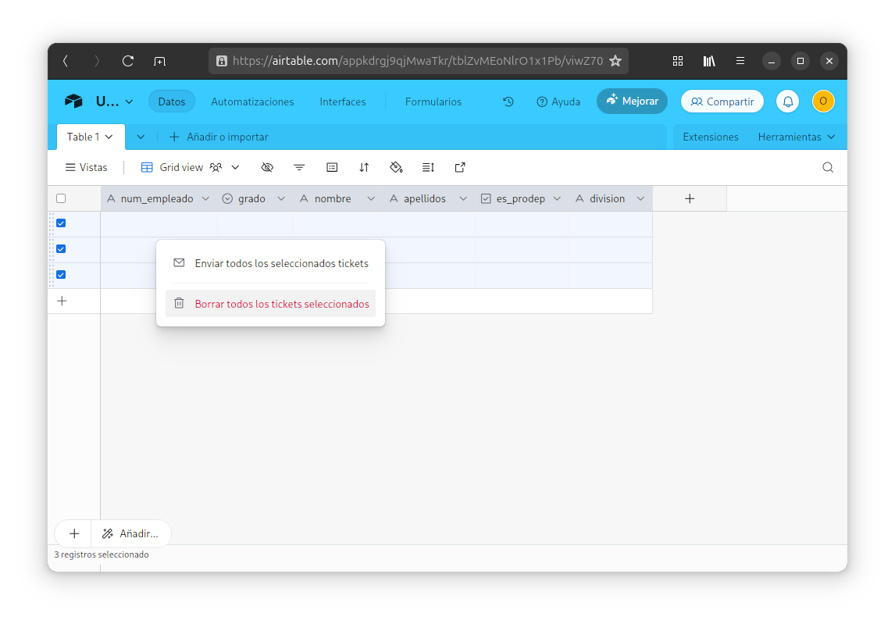

Ah se nos olvidaba algo importante: cambiar el nombre de la base de datos (aunque realmente no
es tan importante porque accederemos a la base de datos a través de su id y no por su nombre.)

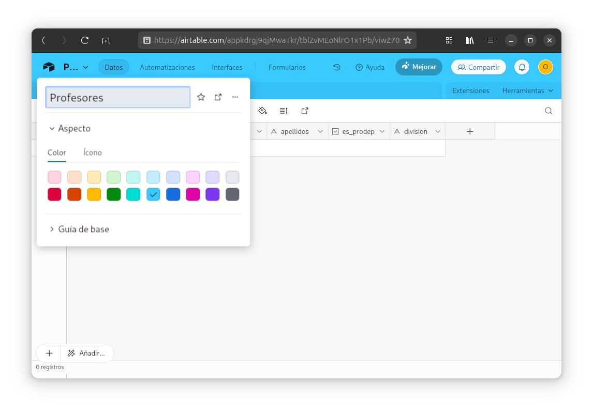

¡__Trasque__ el nombre de la tabla sí que es importante! Cambiémosle el nombre también.

## 1.2 Código

