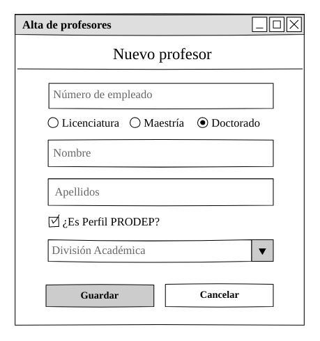

&nbsp;
# 1.  UI

¡Ahora sí vamos a ensuciarnos las manos! Comenzaremos creando la siguiente interfaz de usuario:



Utilizando los siguientes componentes:

- `flet.AppBar`
- `flet.Text`
- `flet.TextField`
- `flet.Radio`
- `flet.Dropdown`
- `flet.Checkbox`
- `flet.ElevatedButton`

Para organizar los componentes usaremos

- `flet.Row`

## 1.1.  Configuración de la ventana

En primer lugar vamos a personalizar el objeto `page` que define nuestro formulario o ventana.
Para definir el tamaño de la ventana tenemos el objeto `window`. Para dejar un espacio entre los componentes y el borde de la ventana tenemos la propiedad `padding`. Finalmente, en Flet tenemos 2 temas disponibles para nuestra aplicación: tema claro (`light`) y tema oscuro (`dark`).

```python
    page.window.width =400
    page.window.height =480
    page.title = "Alta de profesores"
    page.padding = 25
    page.theme_mode = "light"
```

Ahora vamos a crear una barra de título con el componente `AppBar`. Vean que podemos asignar un icono, podemos centrar el título y asingar culaquier color de fondo y de texto que queramos.

```python
    page.appbar = ft.AppBar(
        leading=ft.Icon("person"),
        title=ft.Text("Nuevo profesor"),
        center_title=True,
        bgcolor="blue",
        color="white"
    )
```

Ahora bien, vamos a crear los componentes. Una caja de texto con una etiqueta se crea de la siguiente forma. Vean que le asignamos el foco de manera predeterminada para que el cursor apareza dentro de este componente nada más se inicie la aplicación.

```python
    txt_clave = ft.TextField(label="Número de empleado", autofocus=True)
```

El caso de los botones de radio (_radio buttons_) es un poco más elaborado, puesto que es necesario crear un objeto de tipo `ft.RadioGroup` y dentro de éste colocar componentes `ft.Radio`. Observen que podemos hacer que un radio botón aparezca seleccionado de manera predeterminada.

```python
    rdo_grado = ft.RadioGroup(content=ft.Row([
        ft.Radio(value="Lic.", label="Licenciatura"),
        ft.Radio(value="M.", label="Maestría"),
        ft.Radio(value="Dr.", label="Doctorado")
    ]), value="Dr.")
```

Toca turno de un cuadro combinado, que en Flet se llama _Dropdown_. En este caso dejaremos las opciones vacías porque las cargaremos desde nuestra base de datos.

```python
    drp_division = ft.Dropdown(label="División Académica", options=None, width=400)
```

La caja de selección se crea de la siguiente manera. Nota que lo seleccionamos por defecto.

```python
    chk_prodep = ft.Checkbox(
        " ¿Es perfil PRODEP?",
        label_position=ft.LabelPosition.RIGHT,
        width=320
    )
```

Flet tiene varias clases disponibles para crear botones. Aquí usaremos un botón personalizable llamado _Elevated button_. Observa lo fácil que es configurar un botón con colores, iconos y tamaño personalizados.

```python
    btn_aceptar  = ft.ElevatedButton(
        text="Guardar",
        icon="save",
        bgcolor="green",
        color="white",
        width=150,
        on_click=None
)
```

Para agregar nuestros componentes a la ventana (objeto `page`) es tan sencillo como esto:

```python
    page.add(txt_clave)
    page.add(rdo_grado)
    page.add(txt_nombre)
    page.add(txt_apellidos)
    page.add(chk_prodep)
    page.add(drp_division)
```

Flet apila los componentes en la ventana de manera natural. Sin embargo, queremos que los botones aparezcan un delante del otro horizontalmente. Es entonces que necesitamos usar un componente `Row` para crear este efecto:

```python
    page.add(ft.Row([btn_aceptar, btn_cancelar], alignment="center"))
```

El objeto `Row` lo creamos 'al vuelo' y le enviamos de párametro al constructor una lista con los componentes que queremos que se organicen de manera horizontal. ¡Igual lo podemos centrar en una sola línea!

Al final, no olvides algo súper importante: hay que actualizar el objeto `page` para que refle los cambios realizados:

```python
    page.update()
```

¡Listo! A continuación te presentamos la interfaz terminada en Flet 😎


